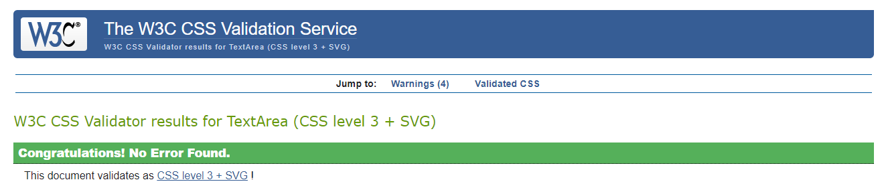

# Wine Yard Testing

## Performance
### Google Lighthouse Performance

[Google Lighthouse](https://developers.google.com/web/tools/lighthouse) was used to test the performance of the website. Performance was affected by Bootstrap, Google Fonts and Stripe.

Home

Products

Product Details

Basket

Checkout

Checkout Success

Profile

Login

Logout

## HTML Validation 
The [W3C Markup Validation Service](https://validator.w3.org/) was used to validate the HTML of the website.

## CSS Validation
The [W3C Jigsaw CSS Validation Service](https://jigsaw.w3.org/css-validator/) was used to validate the CSS of the website.

## JavaScript Validation 
[JSHint](https://jshint.com/) was used to validate the JavaScript/Jquery of the website and no issues were found.

## Manual Testing 

#### Elements on every page
1. Navbar
- Clicked on each link to confirm that it leads to the correct page.
- "Register" and "Log in" buttons are visible and lead to the correct page when clicked if user is logged out.
- "My Profile" and "Log out" buttons are visible and lead to the correct page when clicked if user is logged in.
- "Product Management" is visible and leads the user to the correct page when clicked if the user is a superuser and is logged in.
- Search bar and button search for and display items with correct query.
- All categories are dropped down when clicked on "Wine", "Champagne and Sparkling" and "Country".
- All links to sub categories work correctly.
- Basket icon turns green and displays subtotal when products are added to basket.
- When products are deleted or updated the subtotal is updated.
- When basket is empty, basket icon reverts to grey with a subtotal of "£0.00"

2. Home Page
- The "Shop Now" button works correctly and leads the user to the products page.
- Links on footer work as intended and lead the user to social media sites in a new tab.

3. Products Page
- The products count correctly displays the number of products for all products and updates when products are filtered by category or search term.
- Product name, country of origin, price and image are displayed correctly for each product.
- Products are displayed in a row of four on large screen and decrease as the screen size decreases to mobile screen where one product is listed per row.
- When an image of a product is clicked the user is directed to the correct corresponding product details page.
- The "no image" image is displayed if a product does not have an image.

4. Product Details Page
- The correct name, country of origin, price, size, ABV, image and description are displayed correctly for the product.
- The "no image" image is displayed correctly is the product does not have an image.
- The quantity form is displayed correctly and cannot be decreased below 1 or increased over 99.
- Clicking on "Add to Basket" correctly inserts the correct amount chosen to the basket.
- The "Keep Browsing" button correcty leads the user back to the products page.
- If superuser the "Edit" and "Delete" buttons are display and take the user the correct pages.

5. Reviews
- If there are no reviews for the product the text "There are currently no reviews for this product" is correctly displayed.
- Reviews for a product are correctly displayed.
- When logged out, text informing the user to register or log in is displayed and the links work as expected.
- When logged in the button to "Add Review" is displayed and works correctly when clicked.
- If a user has created a review the buttons to edit and delete the review are visible and work correctly.
- The add and edit review forms work correctly.

6. Basket Page
- If the basket is empty the message confirming that is displayed and the button to "Keep Browsing" is displayed and works accordingly when clicked.
- The basket page correctly displays every product and quantities the user has added.
- The summary which includes subtotal, delivery and grand total displays and is calculated correctly for the products in the basket.
- Update and remove buttons for each product work correctly and is reflected in the totals.
- Product is removed from the basket when deleted.
- "Secure Checkout" and "Keep Browsing" buttons work correctly and direct user to corresponding pages.

7. Checkout Page
- Order summary displayed correctly with correct details.
- The payment form is correctly displayed and placeholder text is visible and correct for each field.
- If user is logged in, personal details are pre-filled if they have chosen to save their details.
- The form does not submit if required fields are not completed, user is directed to the field to complete. 
- Stripe payment works correctly if all details entered correctly.
- Buttons on page work as expected.

8. Checkout Success Page
- Order information is displayed and information is correct.

9. My Profile Page
- Form correctly shows saved personal details of owner which can be updated.
- Form is blank if new user or has chosen not to save personal details.
- Order History is displayed with correct information.

10. Log Out
- User is taken to the logout page when log out button is clicked.
- User is prompted before confirming to log out by clicking the log out button.
- The user is succesfully logged out when clicked.
- Products in the basket are removed when the user logs out.

11. Sign In
- User is succesfully signed in with correct username and password entered.

12. Register
- User is succesfully registered if correct details are entered.
- Incorrect details are notified to the user.

## Bugs discovered:

- Performance issue (render-blocking resources) involving Bootstrap, Google Fonts and Stripe scripts unsolved to due time constraints.

## Further testing
1. Friends and family asked to navigate the site and report any issues found.